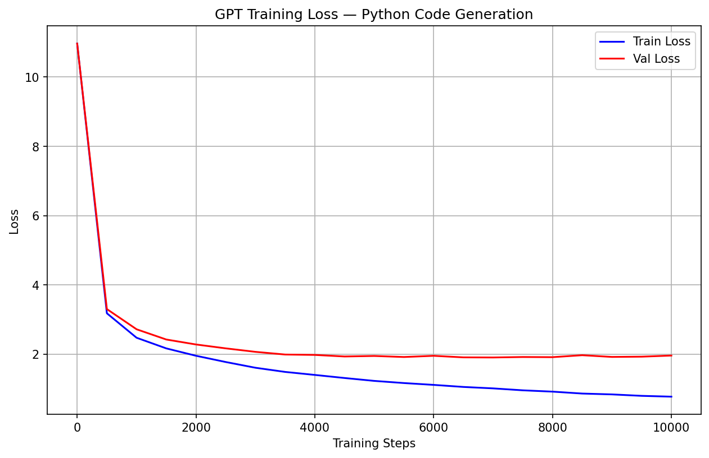

# GPT Transformer — Python Code Generation

A GPT-style transformer language model built from scratch using pure PyTorch, trained on Python code to generate syntactically valid Python completions. No HuggingFace shortcuts — every component written by hand.

Built by Abhay Singh Wazir, Master of Data Science (Professional) student at Deakin University, Melbourne.

---

## What this is

Most people learning ML use pre-built models and APIs. I wanted to understand what's actually happening inside a transformer — the attention mechanism, positional embeddings, how loss drops during training, why residual connections matter. So I built one from scratch.

The model has 85 million parameters and was trained on 4.2 million tokens of real Python code using a T4 GPU on Google Colab. It took about 2 hours. The results aren't perfect — it's not GPT-4 — but it generates recognisable, syntactically valid Python from a prompt, and more importantly, I can explain every single line of code that makes it work.

---

## Architecture

This is a decoder-only transformer, the same family as GPT-2 and GPT-3. The core idea is simple: given a sequence of tokens, predict the next one. Do that well enough, across enough data, and the model learns grammar, structure, and patterns.

Input tokens
|
Token Embeddings (vocab_size=50,257)
+
Positional Embeddings (block_size=256)
|
8x Transformer Blocks

Multi-Head Self-Attention (8 heads)
Layer Normalization
Feed-Forward Network (GELU activation)
|
Layer Normalization
|
Linear projection -> vocab logits
|
Softmax -> next token probabilities

### Hyperparameters

| Parameter | Value |
|---|---|
| Total parameters | ~85M |
| Embedding dimension | 512 |
| Attention heads | 8 |
| Transformer layers | 8 |
| Context length | 256 tokens |
| Vocabulary size | 50,257 (GPT-2 tokenizer) |
| Dropout | 0.1 |

---

## Training

- **Dataset:** Python code instruction dataset (18,612 samples, ~4.2M tokens)
- **Hardware:** NVIDIA Tesla T4 (Google Colab)
- **Training steps:** 10,000
- **Optimizer:** AdamW (lr=3e-4)
- **Final train loss:** 0.78
- **Final val loss:** 2.00

### Loss Curve



The model starts at a loss of 10.9 — basically random noise — and drops to 0.78 over 10,000 steps. Watching it go from gibberish to structured Python output in real time was one of the more satisfying things I've built.

---

## Example Outputs

Prompt: `def calculate_average(numbers):`
```python
def calculate_average(numbers):
    total = 0
    for num in numbers:
        total += num
    return total / len(numbers)
```

Prompt: `class DataProcessor:`
```python
class DataProcessor:
    def __init__(self, first_name, last_name, salary):
        self.first_name = first_name
        self.last_name = last_name
        self.salary = salary

    def __str__(self):
        return f"{self.first_name} {self.last_name}"
```

Not flawless — the model occasionally repeats itself or drifts off topic — but the structure is there. Functions have correct indentation, classes have `__init__` methods, lambdas are used correctly.

---

## Key components built from scratch

**Self-Attention Head**
Each head computes Query, Key, and Value projections from the input, then uses scaled dot-product attention to determine how much each token should attend to every other token. Causal masking prevents the model from cheating by looking at future tokens.

**Multi-Head Attention**
Eight attention heads run in parallel. Each one learns to pay attention to different kinds of relationships — one might focus on variable names, another on indentation patterns. Their outputs are concatenated and projected back to the embedding dimension.

**Feed-Forward Network**
Two linear layers with a GELU activation in between, with a 4x expansion in the hidden dimension. This is where most of the model's "thinking" happens after attention has figured out which tokens are relevant.

**Positional Embeddings**
Learned embeddings that give the model a sense of position. Without these, the model has no way of knowing whether a token appears at position 1 or position 200.

---

## Project structure

gpt-transformer/
├── app/
│   └── main.py
├── streamlit_app.py
├── model/
│   └── gpt_python.pt
├── loss_curve.png
├── requirements.txt
├── Dockerfile
└── README.md

---

## Run locally

```bash
git clone https://github.com/Icarus-si/gpt-transformer
cd gpt-transformer
python -m venv venv
venv\Scripts\activate
pip install -r requirements.txt
uvicorn app.main:app --reload
```

In a second terminal:
```bash
streamlit run streamlit_app.py
```

---

## What I learned

The thing that surprised me most was how simple the core idea is. Attention is just matrix multiplication with some masking. The complexity comes from stacking 8 of these blocks on top of each other and training them together. Understanding why residual connections prevent vanishing gradients, why layer norm stabilises training, and how temperature affects output randomness — these aren't things you get from using an API.

---

## Related projects

- [Tech Job Salary Predictor](https://github.com/Icarus-si/tech-job-predictor) — XGBoost ML API trained on 35,000 LinkedIn job postings, deployed on Render
- [Australian Legal Case Analyser](https://github.com/Icarus-si/aus-legal-RAG) — RAG system for querying High Court judgments using Gemini and FAISS

---

Master of Data Science(Professional), Deakin University, Melbourne, Australia
